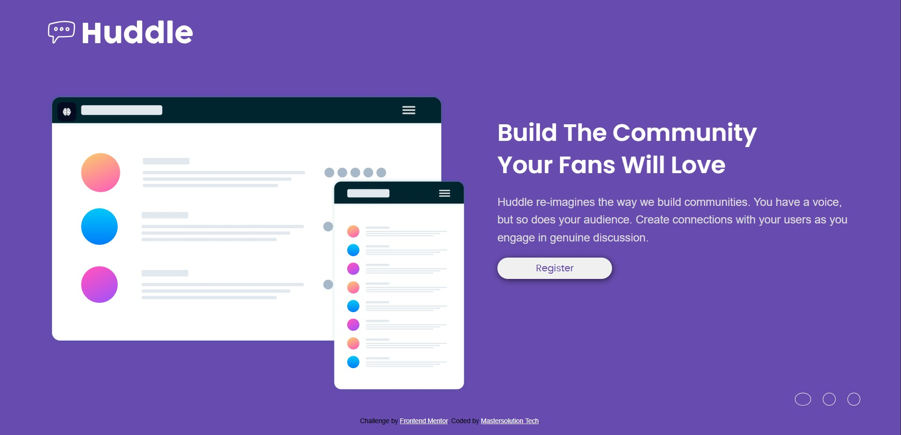

# Huddle landing page with single introductory section on Frontend Mentor

## 📌 Description

This project is a responsive Huddle landing page with single introductory section on Frontend Mentor built with HTML and CSS.
It is a solution to a Frontend Mentor challenge aimed at improving front-end development skills.

## 🚀 Features

- Responsive design (mobile & desktop)
- Clean UI card layout
- Accessible structure (ARIA, semantic HTML)

## 🛠️ Tools Used

- Semantic HTML5 markup
- CSS custom properties
- Flexbox
- Mobile-first workflow

## 📂 Project Structure

```
/project
  ├── design/
  ├── images/
  ├── index.html
  ├── README.md
  ├── styles/stylesheet.css
  ├── styles/mobile.css
```

## ⚠️ Improvements Made

- Added semantic HTML (main, article, footer)
- Improved accessibility (alt text, ARIA)
- Added SEO meta tags
- Fixed layout responsiveness
- Optimized CSS structure

## 🌍 Live Demo

- **GitHub Pages:**

## 📷 Screenshot



## 👨‍💻 Author

**Mastersolution Tech -- Adesegun O.**

LinkedIn: https://www.linkedin.com/in/adesegun-oluwatosin-344911311

## 🙌 Acknowledgments

Frontend Mentor for providing the challenge. 🚀
